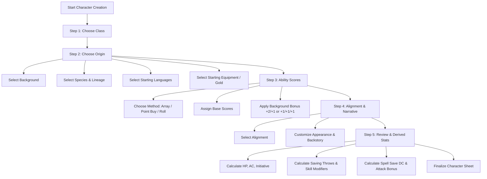

# D&D 2024 Character Creation Walkthrough & App Implementation Guide

This guide provides a structured step-by-step walkthrough for creating a character according to the **2024 Dungeons & Dragons Player's Handbook (PHB)**. It is designed to serve as the definitive reference and data specification for building an interactive character creation wizard in your application.

---

## Architecture of Character Creation (2024 PHB vs 2014)

In the 2024 rules revision, character creation has been streamlined with several key architectural updates:
1. **Backgrounds Grant Ability Score Increases & Feats**: Ability Score Increases (+2/+1 or +1/+1/+1) are now granted by **Background**, not Species. Backgrounds also grant a mandatory **Level 1 Origin Feat**.
2. **Species Grants Innate Ancestry & Special Traits**: Species provides creature size, speed, vision, resistances, and active/passive traits—no ability score modifiers.
3. **Subclasses Unlock at Level 3**: Every class chooses its subclass at Level 3, providing a unified progression curve across all 12 classes.
4. **Weapon Mastery System**: Martial and semi-martial classes unlock Weapon Mastery properties (Cleave, Graze, Nick, Push, Sap, Slow, Topple, Vex) tied to specific weapons.
5. **Origin Feat Requirement**: All Level 1 characters start with at least one Origin Feat from their background (Humans get a second bonus Origin Feat).

---

## Interactive Creation Wizard Flow

Below is the recommended 5-step user journey for your interactive app:



---

## Step 1: Choose a Class

Every character chooses one of the 12 core classes. The class determines hit dice, primary abilities, saving throw proficiencies, armor/weapon proficiencies, level 1 core mechanics, and subclass choices unlocked at level 3.

### Class Comparison Matrix

| Class | Hit Die | Primary Ability | Armor Training | Weapon Proficiencies | Saving Throws | Skill Choices (Pick N) | Level 1 Core Mechanics |
| :--- | :---: | :--- | :--- | :--- | :--- | :---: | :--- |
| **Barbarian** | d12 | Strength | Light, Medium, Shields | Simple, Martial | STR, CON | Pick 2: Animal Handling, Athletics, Intimidation, Nature, Perception, Survival | Rage, Unarmored Defense (10+DEX+CON), Weapon Mastery (2) |
| **Bard** | d8 | Charisma | Light | Simple | DEX, CHA | Pick 3: Any skills | Spellcasting (CHA Caster), Bardic Inspiration (d6), Weapon Mastery (via College) |
| **Cleric** | d8 | Wisdom | Light, Medium, Shields (Heavy via Order) | Simple (Martial via Order) | WIS, CHA | Pick 2: History, Insight, Medicine, Persuasion, Religion | Divine Order (Protector/Thaumaturge), Channel Divinity, Spellcasting (WIS) |
| **Druid** | d8 | Wisdom | Light, Shields (Medium via Order) | Simple (Martial via Order) | INT, WIS | Pick 2: Arcana, Animal Handling, Insight, Medicine, Nature, Perception, Religion, Survival | Primal Order (Magician/Warden), Wild Shape, Wild Companion, Spellcasting (WIS) |
| **Fighter** | d10 | STR or DEX | All Armor, Shields | Simple, Martial | STR, CON | Pick 2: Acrobatics, Animal Handling, Athletics, History, Insight, Intimidation, Perception, Survival | Fighting Style Feat, Second Wind, Weapon Mastery (3), Tactical Mind |
| **Monk** | d8 | DEX & WIS | None | Simple, Martial (Light property) | STR, DEX | Pick 2: Acrobatics, Athletics, History, Insight, Religion, Stealth | Unarmored Defense (10+DEX+WIS), Martial Arts (d6), Deflect Attacks |
| **Paladin** | d10 | STR & CHA | All Armor, Shields | Simple, Martial | WIS, CHA | Pick 2: Athletics, Insight, Intimidation, Medicine, Persuasion, Religion | Lay on Hands, Paladin's Smite, Spellcasting (CHA), Weapon Mastery (2) |
| **Ranger** | d10 | DEX & WIS | Light, Medium, Shields | Simple, Martial | STR, DEX | Pick 3: Animal Handling, Athletics, Insight, Investigation, Nature, Perception, Stealth, Survival | Favored Enemy (Hunter's Mark), Spellcasting (WIS), Weapon Mastery (2), Deft Explorer |
| **Rogue** | d8 | Dexterity | Light | Simple, Martial (Finesse/Light) | DEX, INT | Pick 4: Acrobatics, Athletics, Deception, Insight, Intimidation, Investigation, Perception, Performance, Persuasion, Sleight of Hand, Stealth | Sneak Attack (1d6), Thieves' Cant, Expertise (2), Weapon Mastery (2) |
| **Sorcerer** | d6 | Charisma | None | Simple | CON, CHA | Pick 2: Arcana, Deception, Insight, Intimidation, Persuasion, Religion | Innate Sorcery, Spellcasting (CHA Caster), Sorcery Points & Metamagic (L2) |
| **Warlock** | d8 | Charisma | Light | Simple | WIS, CHA | Pick 2: Arcana, Deception, History, Intimidation, Investigation, Nature, Religion | Eldritch Invocations (Pact of Blade/Chain/Tome), Pact Magic (CHA), Magical Cunning |
| **Wizard** | d6 | Intelligence | None | Simple | INT, WIS | Pick 2: Arcana, History, Insight, Investigation, Medicine, Religion | Spellcasting (INT Caster, Ritual Casting without preparing), Arcane Recovery |

---

### Class & Subclass Breakdown (48 Subclasses Total)

Each of the 12 classes gains access to 4 distinct subclasses at Level 3:

```carousel
#### Barbarian Subclasses
- **Path of the Berserker**: Unleashes Frenzy for extra damage and violent retaliatory strikes.
- **Path of the Wild Heart**: Manifests animal aspects (Bear, Eagle, Wolf) for defensive and tactical versatility during Rage.
- **Path of the World Tree**: Channels cosmic vitality from Yggdrasil to gain temporary HP, extend reach, and teleport allies.
- **Path of the Zealot**: Fights in divine union with a deity, dealing extra Radiant/Necrotic damage and defying death.
<!-- slide -->
#### Bard Subclasses
- **College of Dance**: Harnesses agility to fight unarmed, move unhindered, and share evasion with allies.
- **College of Glamour**: Weaves beguiling Feywild magic to charm crowds and manipulate battlefields with Beguiling Magic.
- **College of Lore**: Collects secrets, gains extra Expertise, cutting words, and early Magical Secrets.
- **College of Valor**: Channels martial bravery, inspiring allies' weapon damage and armor defense while casting spells in melee.
<!-- slide -->
#### Cleric Subclasses
- **Life Domain**: Master of healing magic, boosting hit points restored and heavy armor resilience.
- **Light Domain**: Wields searing radiance, imposing disadvantage on attacker rolls and casting explosive Fireballs.
- **Trickery Domain**: Bedevils foes with illusionary duplicates, stealth enhancements, and deceptive spells.
- **War Domain**: Inspires martial valor, granting extra weapon attacks and bonus damage via divine smite power.
<!-- slide -->
#### Druid Subclasses
- **Circle of the Land**: Draws spellpower from specific biomes (Arid, Polar, Temperate, Tropical) with bonus prepared spells.
- **Circle of the Moon**: Transforms into formidable combat beasts with Swift Transformation and Lunar Radiance attacks.
- **Circle of the Sea**: Manifests oceanic tides and aura of storms to blast enemies with cold and lightning.
- **Circle of Stars**: Harnesses constellations (Archer, Chalice, Dragon) for radiant attacks, boosted healing, or skill bonuses.
<!-- slide -->
#### Fighter Subclasses
- **Battle Master**: Employs combat maneuvers powered by Superiority Dice (d8) to trip, push, disarm, or rally allies.
- **Champion**: Focuses on physical perfection, improved critical hit ranges (19-20), and Remarkable Athlete bonuses.
- **Eldritch Knight**: Combines martial mastery with Abjuration and Evocation arcane spellcasting.
- **Psi Warrior**: Augments strikes and defenses with psionic energy telekinesis and psionic shields.
<!-- slide -->
#### Monk Subclasses
- **Warrior of Mercy**: Manipulates life force to heal wounds with Hand of Healing or harm foes with Hand of Harm.
- **Warrior of Shadow**: Blends into shadows, teleports between darkness, and casts Darkness/Silence with Focus points.
- **Warrior of Elements**: Channels elemental forces to extend strike reach, pull/push targets, and deal fire/cold/lightning damage.
- **Warrior of Open Hand**: Master of physical manipulation, imposing knockdown, push back, or denial of reactions with Flurry of Blows.
<!-- slide -->
#### Paladin Subclasses
- **Oath of Devotion**: Emulates divine purity, boosting weapon hit chances with Sacred Weapon and radiating a protective aura.
- **Oath of Glory**: Strives for legendary heroics, gaining explosive movement speed, athletic feats, and inspirational temp HP.
- **Oath of the Ancients**: Preserves life and nature, casting ensnaring strike and radiating resistance to spell damage.
- **Oath of Vengeance**: Hunts down transgressors with Abjure Foes and Vow of Enmity for constant Advantage on attack rolls.
<!-- slide -->
#### Ranger Subclasses
- **Beast Master**: Bonds with a Primal Companion (Land, Sea, Air) that fights alongside the Ranger in battle.
- **Fey Wanderer**: Infuses weapon strikes with fey mirth/dread, adding Wisdom modifier to all Charisma checks.
- **Gloom Stalker**: Ambushes from darkness, gaining darkvision, extra first-turn attacks, and invisibility to darkvision.
- **Hunter**: Protects nature with tactical adaptations (Colossus Slayer, Horde Breaker, Multiattack Defense).
<!-- slide -->
#### Rogue Subclasses
- **Arcane Trickster**: Enhances thievery and stealth with Mage Hand Legerdemain and Illusion/Enchantment spells.
- **Assassin**: Master of ambushes, disguise kits, lethal poisons, and instant deadly strikes on surprised targets.
- **Soulknife**: Manifests psychic blades for ranged or melee attacks, boosting skill checks with Psi-Bolstered Knacks.
- **Thief**: Infiltrates quickly with Fast Hands (Bonus action item use/thieves' tools), Supreme Sneak, and Use Magic Device.
<!-- slide -->
#### Sorcerer Subclasses
- **Aberrant Sorcery**: Wields psionic alien magic, casting telepathic spells without components and altering form.
- **Clockwork Sorcery**: Channels cosmic law and order to neutralize advantage/disadvantage and create protective shields.
- **Draconic Sorcery**: Inherits dragon traits, gaining elemental resistance, extra HP, draconic wings, and boosted elemental damage.
- **Wild Magic Sorcery**: Unleashes chaotic magic, manipulating probability with Tides of Chaos and triggering Wild Magic Surges.
<!-- slide -->
#### Warlock Subclasses
- **Archfey Patron**: Teleports across the battlefield with Misty Step triggers, unleashing fey charms and illusions.
- **Celestial Patron**: Heals allies with a pool of d6 radiant energy and blasts foes with sacred fire.
- **Fiend Patron**: Gains temporary hit points upon slaying foes, adding d10 to failed ability checks or saving throws.
- **Great Old One Patron**: Establishes telepathic bonds, creates psychic thralls, and turns mind attacks back on attackers.
<!-- slide -->
#### Wizard Subclasses
- **Abjurer**: Creates an Arcane Ward that absorbs damage meant for the wizard and nearby allies.
- **Diviner**: Foresees the future using Portent dice (2d20 rolled after long rest) to replace any d20 roll.
- **Evoker**: Sculpt Spells to keep allies safe inside explosive area spells, boosting cantrip and evocation damage.
- **Illusionist**: Weaves tricky illusions, casting Illusion spells as bonus actions and altering illusion details dynamically.
````

---

## Step 2: Determine Origin (Background & Species)

In D&D 2024, origin is defined by combining **1 Background** and **1 Species**.

### 1. Character Backgrounds (16 Options)

Each background provides:
- **Ability Score Increase**: Choose +2 to one stat and +1 to another, OR +1 to three stats. Must be chosen from the 3 stats listed for that background.
- **1 Origin Feat**
- **2 Skill Proficiencies**
- **1 Tool Proficiency**
- **50 GP Equipment Package or 50 GP Cash**

| Background | Choice of Ability Scores (+2/+1 or +1/+1/+1) | Origin Feat | Skill Proficiencies | Tool Proficiency | Key Starting Equipment |
| :--- | :--- | :--- | :--- | :--- | :--- |
| **Acolyte** | INT, WIS, CHA | Magic Initiate (Cleric) | Insight, Religion | Calligrapher's Supplies | Holy Symbol, Prayer Book, Robe, Calligrapher's Supplies, 8 GP |
| **Artisan** | STR, DEX, INT | Crafter | Investigation, Persuasion | 1 Artisan's Tools choice | Artisan's Tools, Abacus, Pouch, Traveler's Clothes, 28 GP |
| **Charlatan** | DEX, CON, CHA | Skilled | Deception, Sleight of Hand | Disguise Kit | Disguise Kit, Fine Clothes, 15 GP |
| **Criminal** | DEX, CON, INT | Alert | Deception, Stealth | Thieves' Tools | Thieves' Tools, Crowbar, Pouch, Traveler's Clothes, 16 GP |
| **Entertainer** | STR, DEX, CHA | Musician | Acrobatics, Performance | 1 Musical Instrument | Musical Instrument, Costumes (2), Mirror, Perfume, 11 GP |
| **Farmer** | STR, CON, WIS | Tough | Animal Handling, Nature | Carpenter's Tools | Carpenter's Tools, Healer's Kit, Iron Pot, Shovel, 23 GP |
| **Guard** | STR, INT, WIS | Alert | Athletics, Perception | 1 Gaming Set choice | Gaming Set, Hooded Lantern, Manacles, Quiver, 12 GP |
| **Guide** | DEX, CON, WIS | Magic Initiate (Druid) | Stealth, Survival | Cartographer's Tools | Cartographer's Tools, Bedroll, Map Case, Tent, 3 GP |
| **Hermit** | CON, WIS, CHA | Healer | Medicine, Religion | Herbalism Kit | Herbalism Kit, Bedroll, Philosophy Book, Lamp, Oil (3), 15 GP |
| **Merchant** | CON, INT, CHA | Lucky | Animal Handling, Persuasion | Navigator's Tools | Navigator's Tools, Abacus, Pouch, Traveler's Clothes, 22 GP |
| **Noble** | STR, INT, CHA | Skilled | History, Persuasion | 1 Gaming Set choice | Gaming Set, Fine Clothes, Perfume, Signet Ring, 24 GP |
| **Sage** | CON, INT, WIS | Magic Initiate (Wizard) | Arcana, History | Calligrapher's Supplies | Calligrapher's Supplies, Lore Book, Ink & Pen, Parchment (8), 8 GP |
| **Sailor** | STR, DEX, WIS | Tavern Brawler | Athletics, Perception | Navigator's Tools | Navigator's Tools, Dagger, Rope (50 ft), Traveler's Clothes, 10 GP |
| **Scribe** | DEX, INT, WIS | Skilled | Investigation, Perception | Calligrapher's Supplies | Calligrapher's Supplies, Blank Book, Fine Clothes, Ink & Pen, 8 GP |
| **Soldier** | STR, DEX, CON | Savage Attacker | Athletics, Intimidation | 1 Gaming Set choice | Gaming Set, Healer's Kit, Quiver, Traveler's Clothes, 14 GP |
| **Wayfarer** | DEX, WIS, CHA | Lucky | Insight, Stealth | Thieves' Tools | Thieves' Tools, Bedroll, Pouch, Traveler's Clothes, 16 GP |

---

### 2. Species Descriptions (10 Options)

| Species | Size | Speed | Vision | Innate Traits & Lineage Options |
| :--- | :---: | :---: | :---: | :--- |
| **Aasimar** | Medium / Small | 30 ft | Darkvision 60 ft | **Celestial Resistance** (Necrotic & Radiant resistance), **Healing Hands** (Heal HP = PB once/long rest), **Light Bearer** (Light cantrip), **Celestial Revelation** (L3 choice: Heavenly Wings fly speed, Inner Radiance aura, or Necrotic Shroud fear). |
| **Dragonborn** | Medium / Small | 30 ft | Darkvision 60 ft | **Draconic Ancestry** (Damage Resistance & 15-ft Cone/30-ft Line Breath Weapon: Black/Copper=Acid, Blue/Bronze=Lightning, Brass/Gold/Red=Fire, Green=Poison, Silver/White=Cold), **Draconic Flight** (L5 fly speed for 10 min once/long rest). |
| **Dwarf** | Medium / Small | 30 ft | Darkvision 120 ft | **Dwarven Toughness** (+1 Max HP per level), **Dwarven Resilience** (Advantage & Resistance vs Poison), **Stonecunning** (Bonus action Tremorsense 60 ft on stone for 10 min PB times/long rest). |
| **Elf** | Medium / Small | 30 ft | Darkvision 60 ft (120 ft Drow) | **Fey Ancestry** (Advantage vs Charm, immune to magic sleep), **Keen Senses** (Insight, Perception, or Survival proficiency), **Trance** (4-hour long rest), **Elven Lineage**: <br>- *Drow*: 120ft Darkvision, Dancing Lights, Faerie Fire (L3), Darkness (L5).<br>- *High Elf*: Prestidigitation, Detect Magic (L3), Misty Step (L5).<br>- *Wood Elf*: 35ft Speed, Druidcraft, Longstrider (L3), Pass Without Trace (L5). |
| **Gnome** | Medium / Small | 30 ft | Darkvision 60 ft | **Gnomish Cunning** (Advantage on INT, WIS, CHA saving throws), **Gnomish Lineage**:<br>- *Forest Gnome*: Minor Illusion cantrip, Speak with Small Beasts.<br>- *Rock Gnome*: Mending & Prestidigitation cantrips, Tinker clockwork devices. |
| **Goliath** | Medium / Small | 30 ft | Darkvision 60 ft | **Powerful Build** (Count as 1 size larger for carrying/pushing), **Large Form** (L5 turn Large for 10 min, +10 ft speed, Advantage on STR checks), **Giant Ancestry** (Choice of Cloud's Jaunt teleport, Fire's Burn fire dmg, Frost's Chill cold dmg, Hill's Tumble knock prone, Stone's Endurance damage reduction, Storm's Thunder reaction). |
| **Halfling** | Small | 30 ft | Normal | **Brave** (Advantage vs Frightened), **Halfling Nimbleness** (Move through space of larger creatures), **Luck** (Reroll 1s on d20 tests), **Naturally Stealthy** (Hide behind larger creatures). |
| **Human** | Medium / Small | 30 ft | Normal | **Resourceful** (Gain Heroic Inspiration after every Long Rest), **Skillful** (Proficiency in 1 skill of choice), **Versatile** (Gain 1 extra Origin Feat of choice). |
| **Orc** | Medium / Small | 30 ft | Darkvision 120 ft | **Adrenaline Rush** (Bonus action Dash + Gain Temp HP = PB, PB times/long rest), **Relentless Endurance** (When dropped to 0 HP, drop to 1 HP instead once/long rest). |
| **Tiefling** | Medium / Small | 30 ft | Darkvision 60 ft | **Otherworldly Presence** (Thaumaturgy cantrip), **Fiendish Legacy**:<br>- *Abyssal*: Poison resistance, Poison Spray, Ray of Sickness (L3), Hold Person (L5).<br>- *Chthonic*: Necrotic resistance, Chill Touch, False Life (L3), Ray of Enfeeblement (L5).<br>- *Infernal*: Fire resistance, Fire Bolt, Hellish Rebuke (L3), Darkness (L5). |

---

## Step 3: Determine Ability Scores

Characters have 6 primary Ability Scores: **Strength (STR)**, **Dexterity (DEX)**, **Constitution (CON)**, **Intelligence (INT)**, **Wisdom (WIS)**, and **Charisma (CHA)**.

### Generation Methods

1. **Standard Array**: Assign the values `[15, 14, 13, 12, 10, 8]` across the 6 abilities before background adjustments.
2. **Point Buy System**: Spend 27 points to purchase scores between 8 and 15:
   
   | Ability Score | Point Cost |
   | :---: | :---: |
   | 8 | 0 |
   | 9 | 1 |
   | 10 | 2 |
   | 11 | 3 |
   | 12 | 4 |
   | 13 | 5 |
   | 14 | 7 |
   | 15 | 9 |

3. **Rolling (4d6 Drop Lowest)**: Roll four 6-sided dice, drop the lowest die, and sum the remaining three (repeating 6 times).

### Applying Background Bonus

Add either:
- **+2 to stat A and +1 to stat B**, OR
- **+1 to stat A, +1 to stat B, and +1 to stat C**

*Constraint*: The chosen stats must be selected from the 3 abilities listed for the character's background.

### Modifier Formula & Table

$$\text{Modifier} = \left\lfloor \frac{\text{Score} - 10}{2} \right\rfloor$$

| Score | Modifier | Score | Modifier |
| :---: | :---: | :---: | :---: |
| 1 | -5 | 14–15 | +2 |
| 2–3 | -4 | 16–17 | +3 |
| 4–5 | -3 | 18–19 | +4 |
| 6–7 | -2 | 20–21 | +5 |
| 8–9 | -1 | 22–23 | +6 |
| 10–11 | +0 | 24–25 | +7 |
| 12–13 | +1 | 26–27 | +8 |

---

## Step 4: Alignment & Personality Details

Players choose one of 9 moral alignments:

```
                  GOOD           NEUTRAL          EVIL
             +--------------+--------------+--------------+
  LAWFUL     | Lawful Good  | Lawful Neutral| Lawful Evil  |
             +--------------+--------------+--------------+
  NEUTRAL    | Neutral Good | True Neutral  | Neutral Evil |
             +--------------+--------------+--------------+
  CHAOTIC    | Chaotic Good |Chaotic Neutral| Chaotic Evil |
             +--------------+--------------+--------------+
```

Players also define:
- **Languages**: Common + 2 additional languages (Standard: Common Sign Language, Draconic, Dwarvish, Elvish, Giant, Gnomish, Goblin, Halfling, Orc; Rare: Abyssal, Celestial, Deep Speech, Druidic, Infernal, Primordial, Sylvan, Thieves' Cant, Undercommon).
- **Physical Traits**: Gender, Age, Height, Weight, Hair, Eyes, Skin tone.
- **Personal Identity**: Personality traits, Ideals, Bonds, Flaws, and Character Name.

---

## Step 5: Derived Stats & Calculations

Once Class, Origin, Ability Scores, and Equipment are selected, calculate the following derived statistics:

### 1. Hit Points (HP at Level 1)
$$\text{Level 1 HP} = \text{Max Hit Die Value} + \text{CON Modifier} + \text{Bonus HP (e.g., +1 for Dwarf / Tough feat)}$$

### 2. Armor Class (AC)
- **Unarmored**: $10 + \text{DEX Modifier}$
- **Barbarian Unarmored**: $10 + \text{DEX Modifier} + \text{CON Modifier}$
- **Monk Unarmored**: $10 + \text{DEX Modifier} + \text{WIS Modifier}$
- **Light Armor**: $\text{Armor Base AC} + \text{DEX Modifier}$
- **Medium Armor**: $\text{Armor Base AC} + \min(\text{DEX Modifier}, 2)$
- **Heavy Armor**: $\text{Armor Base AC}$ *(No DEX bonus)*
- **Shield**: Adds $+2 \text{ AC}$ when equipped.

### 3. Combat Metrics
- **Initiative**: $\text{DEX Modifier} + \text{Initiative Bonuses (e.g., Alert Feat)}$
- **Proficiency Bonus (PB)**: $+2$ at Levels 1–4 ($+3$ at L5–8, $+4$ at L9–12, $+5$ at L13–16, $+6$ at L17–20).
- **Passive Perception**: $10 + \text{WIS (Perception) Modifier} + (\text{+5 if Advantage})$.

### 4. Spellcasting Statistics (If Applicable)
- **Spell Save DC**: $8 + \text{Proficiency Bonus} + \text{Spellcasting Ability Modifier}$
- **Spell Attack Bonus**: $\text{Proficiency Bonus} + \text{Spellcasting Ability Modifier}$

---

## Feats Registry (75 Feats in 2024 PHB)

Feats are divided into 4 categories:

### 1. Origin Feats (10 Feats - Level 1)
- **Alert**: Gain Initiative bonus equal to PB; swap initiative positions with willing ally at start of combat.
- **Crafter**: Gain proficiency in 3 Artisan's Tools; fast crafting; 20% discount on nonmagical items bought.
- **Healer**: Re-roll 1s on healing dice; use Healer's Kit to restore HP ($1\text{d}4 + 1 + \text{target's Hit Dice}$).
- **Lucky**: Gain Luck Points equal to PB to gain Advantage on rolls or force Disadvantage on attack rolls against you.
- **Magic Initiate**: Learn 2 Cantrips and 1 Level 1 Spell from Cleric, Druid, or Wizard spell list.
- **Musician**: Gain proficiency in 3 Musical Instruments; grant Heroic Inspiration to allies after short/long rest.
- **Savage Attacker**: Roll weapon damage twice and take higher result once per turn.
- **Skilled**: Gain proficiency in any 3 skills of your choice.
- **Tavern Brawler**: Unarmed strike deals $1\text{d}4 + \text{STR}$; push target 5 ft; reroll 1s on unarmed damage.
- **Tough**: Increase maximum Hit Points by $+2$ per level (including Level 1).

### 2. General Feats (43 Feats - Level 4+ Prerequisites)
Ability Score Improvement (+2 to one stat or +1 to two stats), Actor, Athlete, Charger, Chef, Crossbow Expert, Crusher, Defensive Duelist, Dual Wielder, Durable, Elemental Adept, Fey-Touched, Grappler, Great Weapon Master, Heavily Armored, Heavy Armor Master, Inspiring Leader, Keen Mind, Lightly Armored, Mage Slayer, Martial Weapon Training, Medium Armor Master, Moderately Armored, Mounted Combatant, Observant, Piercer, Poisoner, Polearm Master, Resilient, Ritual Caster, Sentinel, Shadow-Touched, Sharpshooter, Shield Master, Skill Expert, Skulker, Slasher, Speedy, Spell Sniper, Telekinetic, Telepathic, War Caster, Weapon Master.

### 3. Fighting Style Feats (10 Feats - Level 2+ Paladin/Ranger/Fighter)
Archery (+2 to ranged attacks), Blind Fighting (Blindsight 10 ft), Defense (+1 AC in armor), Dueling (+2 melee damage with single weapon), Great Weapon Fighting (Reroll 1s/2s on 2H weapons), Interception (Reduce damage to ally by $1\text{d}10+\text{PB}$), Protection (Impose disadvantage on attacks vs ally), Thrown Weapon Fighting (+2 damage with thrown weapons), Two-Weapon Fighting (Add modifier to off-hand attack), Unarmed Fighting (Unarmed strikes deal 1d6/1d8 damage).

### 4. Epic Boon Feats (12 Feats - Level 19+)
Boon of Combat Prowess, Boon of Dimensional Travel, Boon of Energy Resistance, Boon of Fate, Boon of Fortitude, Boon of Irresistible Offense, Boon of Recovery, Boon of Skill, Boon of Speed, Boon of Spell Recall, Boon of the Night Spirit, Boon of Truesight.

---

## Equipment & Weapon Mastery System

### Weapon Mastery Properties
Characters with the **Weapon Mastery** feature can unlock specific secondary effects on weapon hits:

| Property | Description |
| :--- | :--- |
| **Cleave** | On hit with melee attack, make second attack against adjacent creature within reach (deals base weapon die without modifier). |
| **Graze** | On missed melee attack roll, deal damage equal to ability modifier used for the roll. |
| **Nick** | Make extra attack from Light weapon property as part of the Attack action rather than as a Bonus Action. |
| **Push** | On hit, push target up to 10 feet straight away (Medium or smaller). |
| **Sap** | On hit, impose Disadvantage on target's next attack roll before start of your next turn. |
| **Slow** | On hit dealing damage, reduce target's speed by 10 feet until start of your next turn. |
| **Topple** | On hit, force target to make CON saving throw ($\text{DC } 8 + \text{PB} + \text{Ability Mod}$) or be knocked Prone. |
| **Vex** | On hit dealing damage, gain Advantage on your next attack roll against that target before end of next turn. |

---

## App Implementation Data Schema (JSON Spec)

To implement this interactive creator in your application, store the character state in a structured JSON schema:

```json
{
  "$schema": "https://json-schema.org/draft/2020-12/schema",
  "title": "CharacterCreationState2024",
  "type": "object",
  "properties": {
    "characterName": { "type": "string" },
    "level": { "type": "integer", "default": 1 },
    "alignment": { "type": "string", "enum": ["Lawful Good", "Neutral Good", "Chaotic Good", "Lawful Neutral", "True Neutral", "Chaotic Neutral", "Lawful Evil", "Neutral Evil", "Chaotic Evil"] },
    "class": {
      "type": "object",
      "properties": {
        "className": { "type": "string" },
        "subclass": { "type": "string", "nullable": true },
        "selectedSkills": { "type": "array", "items": { "type": "string" } },
        "orderOrStyle": { "type": "string", "nullable": true }
      },
      "required": ["className", "selectedSkills"]
    },
    "origin": {
      "type": "object",
      "properties": {
        "background": {
          "type": "object",
          "properties": {
            "name": { "type": "string" },
            "abilityScoreBonuses": {
              "type": "object",
              "additionalProperties": { "type": "integer" }
            },
            "originFeat": { "type": "string" },
            "selectedTool": { "type": "string" }
          },
          "required": ["name", "abilityScoreBonuses", "originFeat"]
        },
        "species": {
          "type": "object",
          "properties": {
            "name": { "type": "string" },
            "size": { "type": "string", "enum": ["Medium", "Small"] },
            "lineage": { "type": "string", "nullable": true },
            "ancestralChoice": { "type": "string", "nullable": true }
          },
          "required": ["name", "size"]
        },
        "languages": { "type": "array", "items": { "type": "string" } }
      },
      "required": ["background", "species", "languages"]
    },
    "abilityScores": {
      "type": "object",
      "properties": {
        "method": { "type": "string", "enum": ["Standard Array", "Point Buy", "Manual Roll"] },
        "base": {
          "type": "object",
          "properties": {
            "STR": { "type": "integer" }, "DEX": { "type": "integer" }, "CON": { "type": "integer" },
            "INT": { "type": "integer" }, "WIS": { "type": "integer" }, "CHA": { "type": "integer" }
          }
        }
      }
    },
    "equipment": {
      "type": "object",
      "properties": {
        "mode": { "type": "string", "enum": ["Equipment Package", "Starting Gold"] },
        "startingGold": { "type": "integer" },
        "inventory": { "type": "array", "items": { "type": "string" } },
        "equippedArmor": { "type": "string", "nullable": true },
        "equippedShield": { "type": "boolean", "default": false }
      }
    }
  },
  "required": ["characterName", "level", "class", "origin", "abilityScores", "equipment"]
}
```

---

## Summary Checklist for Developers

When implementing your interactive app UI:
- [x] **Enforce Background Stat Validation**: Verify that user-selected +2/+1 or +1/+1/+1 bonuses match the 3 designated stats of their chosen background.
- [x] **Auto-grant Level 1 Feats**: Instantly attach the origin feat tied to the selected background, plus 1 extra origin feat if the species is Human.
- [x] **Calculate Hit Points Automatically**: Set Level 1 HP to `Max Hit Die + CON Modifier (+ traits)`.
- [x] **Filter Weapon Mastery**: Only display weapon mastery options for weapons the selected class is proficient with.
- [x] **Validate Armor Training**: Calculate AC using DEX caps (Unarmored vs Light vs Medium vs Heavy) based on equipped armor and class proficiency.
